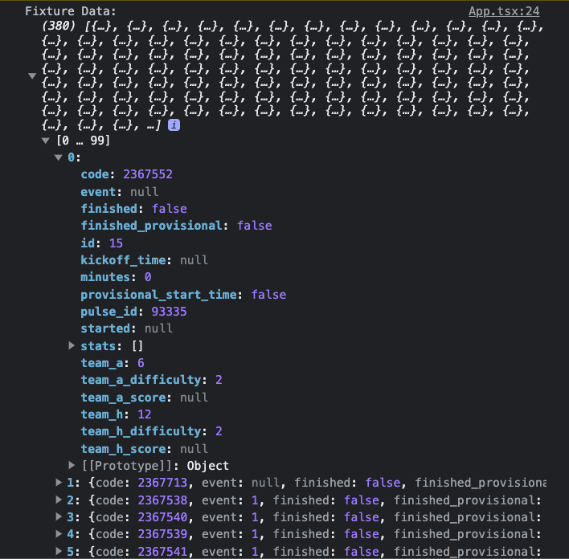
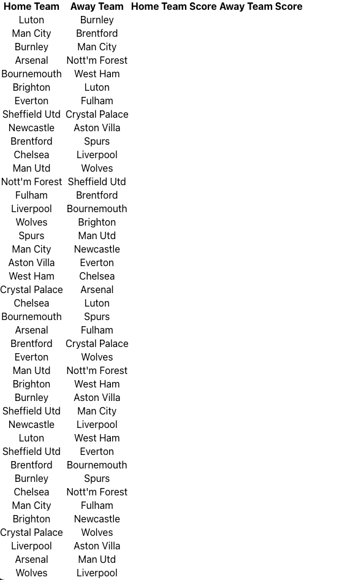
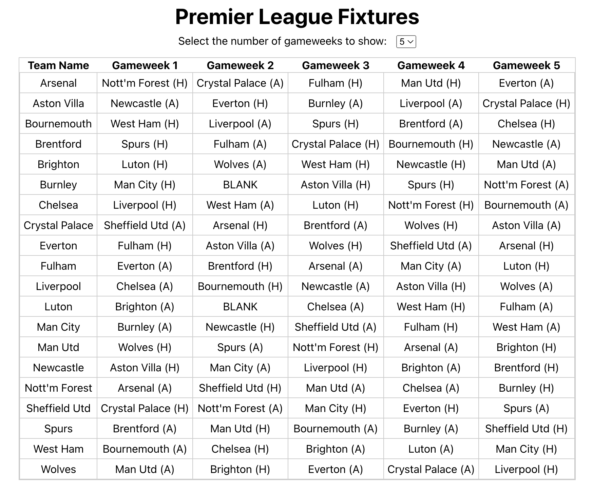
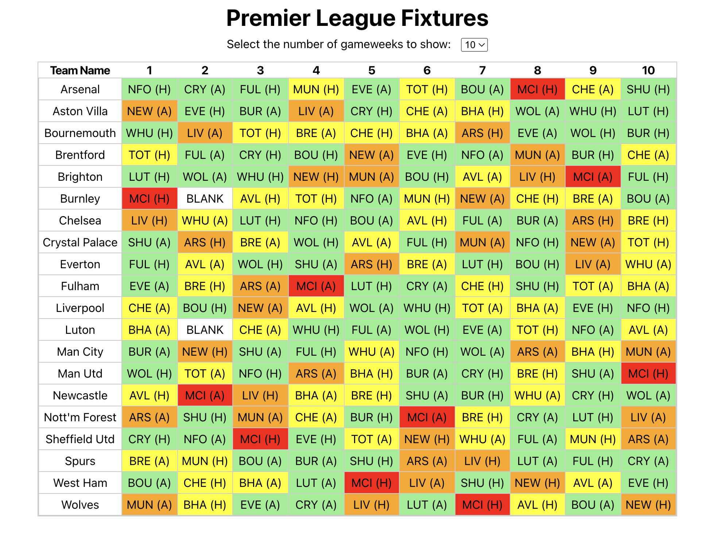

# fpl-playground-new
FPL side project 

To see my current plan as I work through it check out the <a href="https://github.com/lastcastleofbowser/fpl-playground-new/blob/main/plan.md">plan.md</a> file.

See progress photos of how the site developed

1 - setting up the API to grab fixture data
</img>

2 - The data was fetched as a monolithic beast without any structure
</img>

3 - Laying out the data for each gameweek
</img>

4 - Linking the dropdown menu to the gameweek
<video width="320" height="240" controls>
  <source src="FPL4.mov" type="video/mp4">
</video>

5 - Setting up the Fixture Difficulty Rating (FDR)
</img>